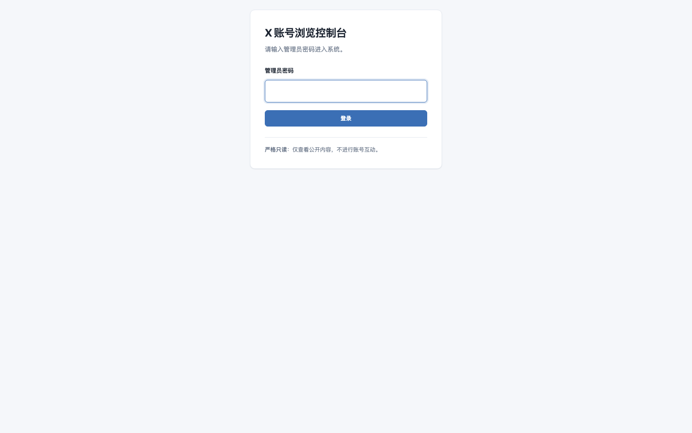
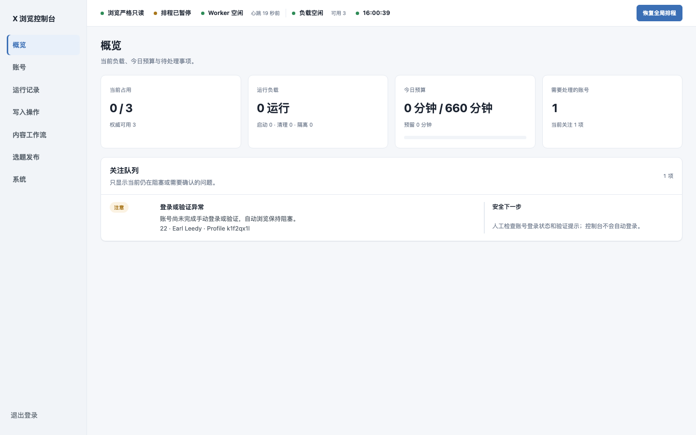
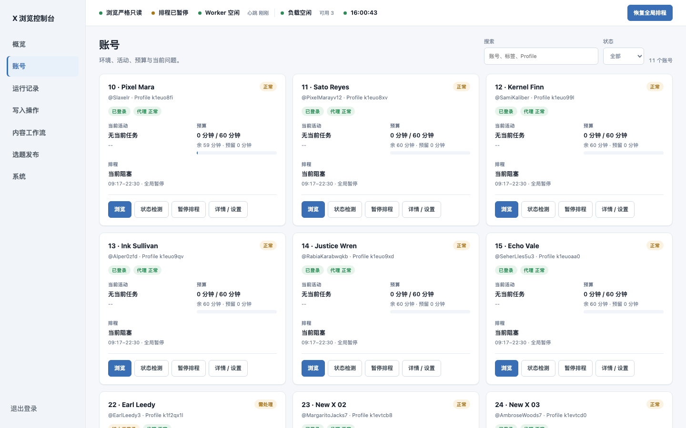
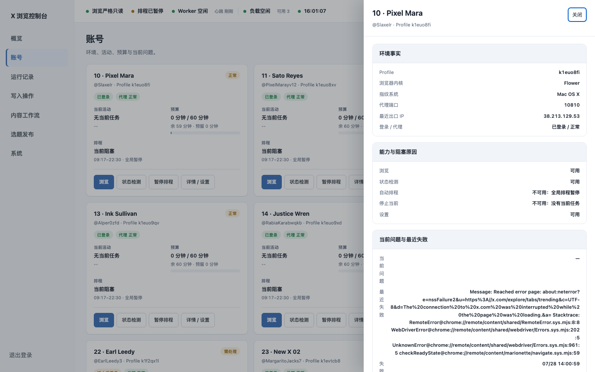
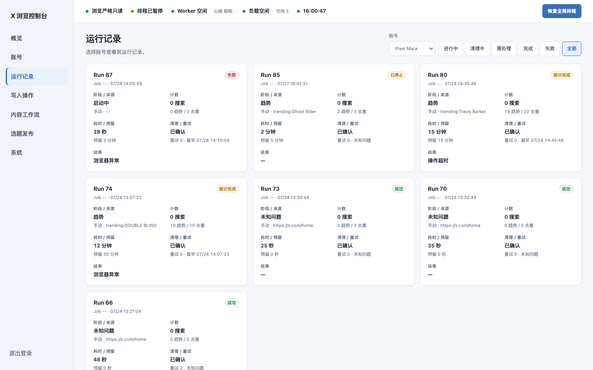
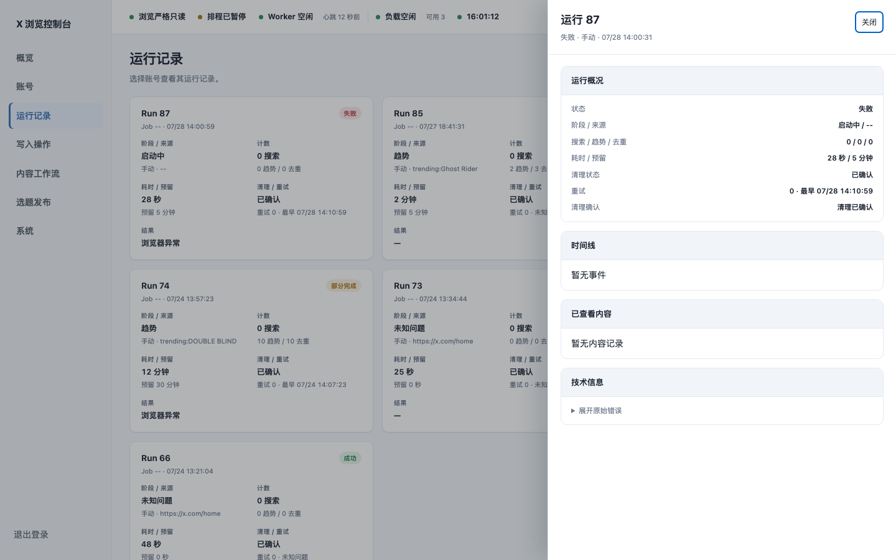
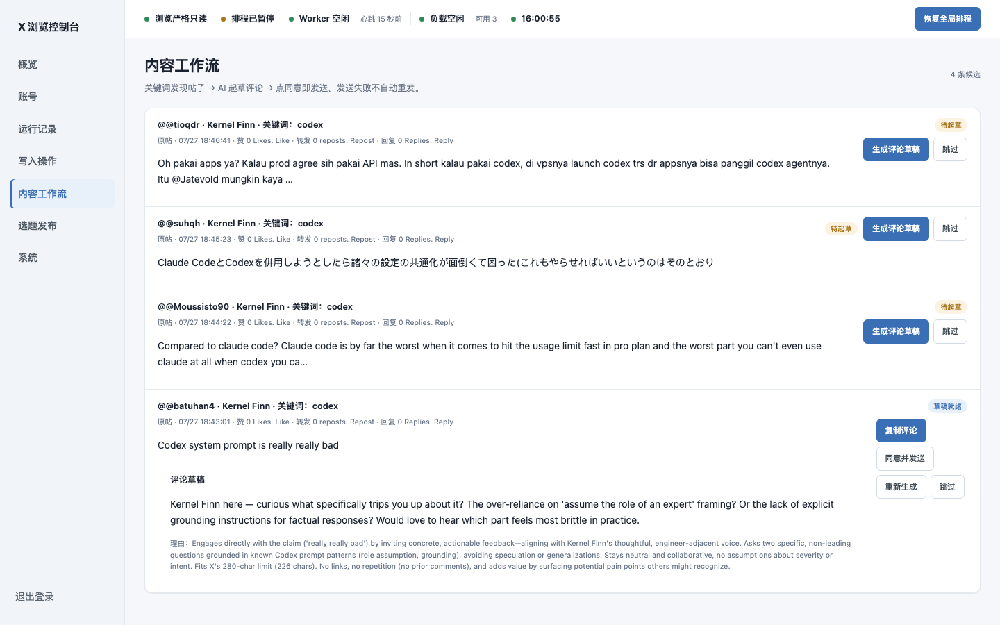
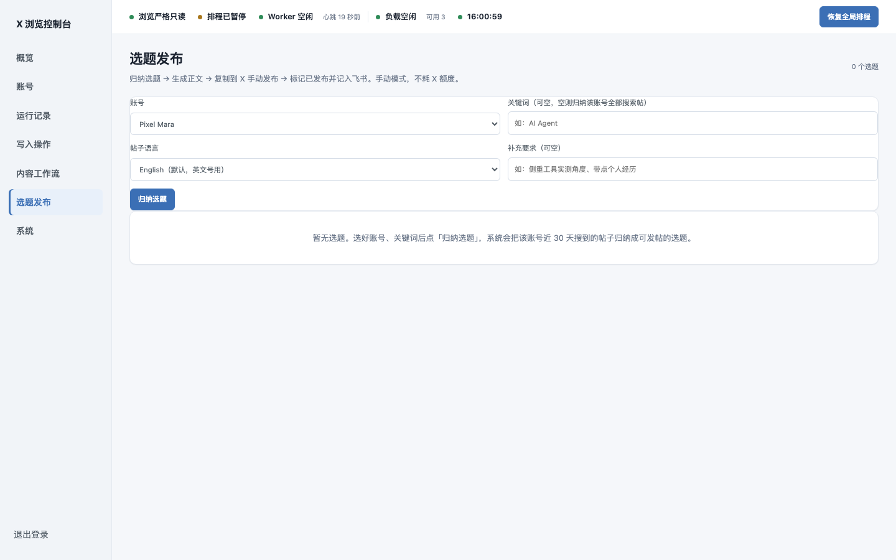
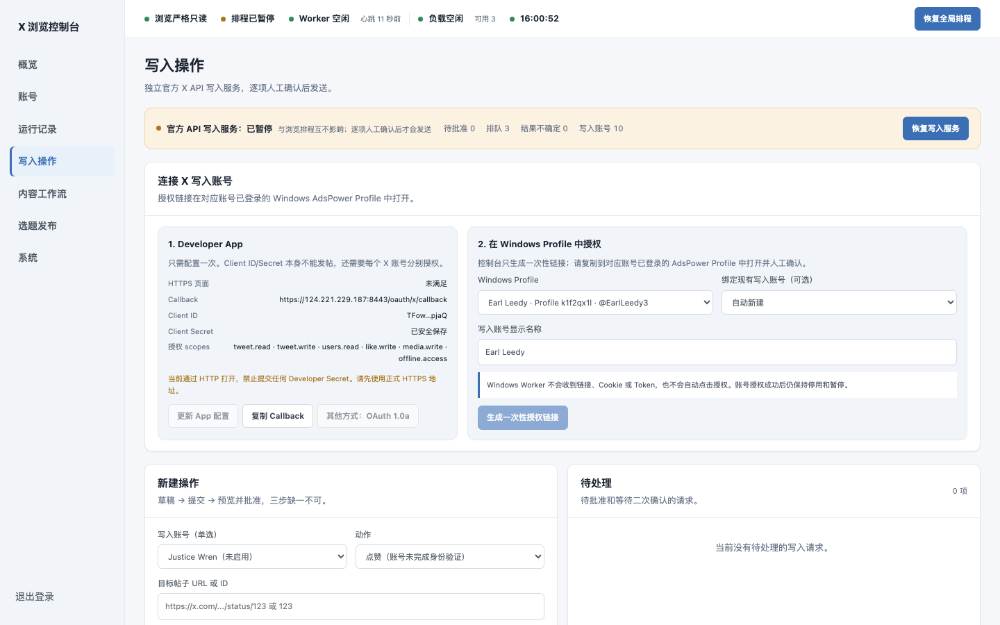
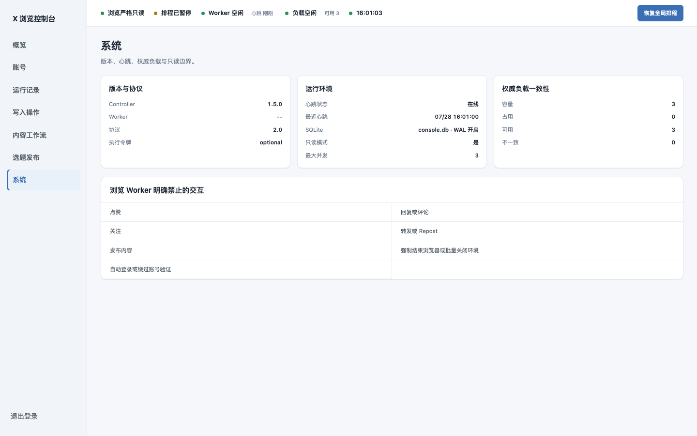

# X 浏览控制台 · 运营操作手册

> 适用对象：运营同学（无需技术背景）
> 面板地址：**http://124.221.229.187:8790**
> 版本：2026-07-28（卡片版界面）

---

## 目录

1. [登录](#1-登录)
2. [顶部状态条（每个灯是什么意思）](#2-顶部状态条)
3. [概览](#3-概览)
4. [账号](#4-账号)
5. [运行记录](#5-运行记录)
6. [内容工作流（AI 评论）](#6-内容工作流ai-评论)
7. [选题发布（AI 发帖）](#7-选题发布ai-发帖)
8. [写入操作（高级，暂不需要日常用）](#8-写入操作)
9. [系统](#9-系统)
10. [常见问题 FAQ](#10-常见问题-faq)
11. [红线（绝对不能做的事）](#11-红线)

---

## 1. 登录

打开 http://124.221.229.187:8790 ，输入管理员密码，点「登录」。

- 密码找技术负责人要，不要外传、不要存在聊天群里。
- 登录态会保持一段时间；过期会自动跳回这个页面，重新登录即可。
- 左下角「严格只读」是系统承诺：**浏览账号永远不会自动点赞、评论、关注、发帖**（发帖/评论只会在你明确确认后，走另一条受控通道）。

---

## 2. 顶部状态条

登录后任何页面顶部都有这一排状态灯，一眼判断系统健不健康：

| 灯 | 含义 | 什么时候要找人 |
|---|---|---|
| ● 浏览严格只读 | 常亮绿灯，安全承诺 | 不用管 |
| ● 排程运行中 / 已暂停 | 全局自动排程开关状态 | 显示"已暂停"通常是**技术故意的**（比如修代理期间），别自己点恢复 |
| ● Worker 空闲/运行中 | Windows 执行机是否在线、是否在干活 | 显示"离线"且长时间不恢复 → 找技术 |
| ● 负载空闲 / 运行 N | 当前几个账号在同时浏览，最多 3 个 | 不用管 |
| ● 时间 | 最后一次数据刷新时间 | 数据像是很久没动 → 刷新页面，还不行找技术 |

最右侧的「暂停/恢复全局排程」按钮：**运营不要点**，由技术管理。

---

## 3. 概览

进系统第一眼。回答三个问题：现在忙不忙？今天浏览预算用了多少？有没有要我处理的事？

- **当前占用**：正在浏览的账号数 / 总槽位（3）。
- **运行负载**：运行 / 启动 / 清理 / 隔离 各几个。
- **今日预算**：所有账号今天的浏览时长合计用量（每个账号每天有预算上限）。
- **需要处理的账号**：有红数字就看下面的**关注队列**。

**关注队列**：只列出"现在真的卡住"的问题，每条都写了「安全下一步」告诉你该怎么办。大部分是"需要人工登录/验证账号"这类——按提示去 AdsPower 里处理对应 Profile 即可。

---

## 4. 账号

每个 X 账号一张卡片，状态一目了然。

**一张卡片怎么读：**

- 标题：`编号 · 昵称`，下面是 `@X 账号名 · Profile 编号`（Profile 就是 AdsPower 指纹浏览器里对应的环境）。
- 徽章：**健康**（正常/需处理）、**登录状态**（已登录/未登录/待人工登录）、**代理状态**（正常=这个账号的代理出口活着）。
- **当前活动**：这个账号现在有没有在浏览。
- **预算**：今天已用 / 总额（分钟），带进度条；下面小字是剩余和预留。
- **排程**：自动排程对这个账号是否生效，时间窗口是几点到几点。

**卡片上的按钮：**

| 按钮 | 作用 | 日常用不用 |
|---|---|---|
| 浏览 ▼ | 手动让这个账号浏览一轮（5/15/30 分钟或用完剩余预算） | 想立刻补一轮浏览时用 |
| 状态检测 | 让系统去检查这个账号的登录和代理（只检测，不浏览） | 怀疑账号掉线时点 |
| 暂停排程 / 恢复排程 | 暂停/恢复**这一个账号**的自动浏览 | 账号异常时用 |
| 详情 / 设置 | 打开详情抽屉（见下） | 改关键词、查问题用 |

**点卡片正文**（不点按钮）打开详情抽屉：

抽屉里能看到：环境事实（Profile、内核、代理端口、出口 IP）、能力与阻塞原因、当前问题与最近失败、预算与排程、设置表单。

**设置里你可能要改的：**
- **关键词**：这个账号浏览时搜什么词，每行一个。改了影响"内容工作流"和"选题发布"的候选内容。
- **每日选取数量 / 优先级 / 时间窗口**：一般用默认值。
- **启用账号自动排程**：勾上后系统会在时间窗口内自动安排它浏览。

改完点「保存设置」。没保存就关抽屉会提示你。

---

## 5. 运行记录

**按账号看**：顶部先选账号（默认是你最近活跃的那个），只看这一个账号的浏览历史。

- **账号选择器**：左上角下拉，选谁就看谁。
- **筛选标签**：进行中 / 清理中 / 需处理 / 完成 / 失败 / 全部。
- 每条运行一张卡：阶段与来源、计数（搜到多少帖）、耗时、清理与重试、结果。
- **点卡片**打开运行详情抽屉，能看到时间线和浏览过的内容链接：

失败的运行卡片上会写一句简短原因（如"长时间无进展""页面结构异常"）。偶发失败正常（X 页面改版、网络抖动都会触发）；**同一账号连续多次失败**就该找技术看。

---

## 6. 内容工作流（AI 评论）

**用途**：系统把账号浏览时搜到的帖子汇集起来，AI 帮你写好评论草稿，你挑合适的**复制去 X 手动回复**。

**每条候选帖的操作：**

| 按钮 | 作用 |
|---|---|
| 生成评论草稿 | AI 分析原帖并写一条评论（约 10-30 秒） |
| 复制评论 | 草稿生成后点这个，评论进剪贴板 → 去 X 上手动回复 |
| 标记已评论 | 手动回复完成后点这个 → 该条标记为已发布，并**自动写入飞书「评论记录」表** |
| 同意并发送 | （暂为灰的）等自动通道恢复后，一键由系统代发 |
| 重新生成 | 不满意让 AI 再写一条 |
| 跳过 | 这条不处理，以后不再出现 |

**标准动作**：生成草稿 → 读一遍 → 满意就「复制评论」→ 打开 X 找到原帖手动回复 → 回来点「**标记已评论**」（飞书记录表自动记一行）。

> AI 写的评论默认不带链接、不吹不黑、针对原帖内容。觉得不像人话就「重新生成」。

---

## 7. 选题发布（AI 发帖）

**用途**：把账号浏览过的帖子归纳成选题，AI 生成 X 帖子正文，你**复制去 X 手动发帖**，发完回来标记，系统记到飞书。

**完整流程（每天的发帖动作）：**

1. **选账号**（左上角下拉，选要发帖的那个号）。
2. 可填**关键词**（不填就归纳该号全部搜索帖）、**帖子语言**（英文号选 English 默认）、**补充要求**（比如"侧重工具实测角度"）。
3. 点「**归纳选题**」→ 系统把近 30 天搜到的帖子归纳成最多 8 个选题（约 30-60 秒）。
4. 每个选题卡片显示：主题、主要观点、延展角度、来源链接、风险。看哪个顺眼，点「**生成正文**」。
5. 正文出来后：
   - 「**复制正文**」→ 去 X 用对应账号手动发帖
   - 不满意「**重新生成正文**」
   - 不合适「**跳过**」
6. **发完之后**回到面板点「**标记已发布**」，（可选）贴上帖子链接 → 系统自动写入飞书「发帖记录」表。

> **为什么正文是英文？** 这些 X 账号是英文人设，正文默认用母语者口吻的英文生成。要中文就在"帖子语言"里切换。
> **图怎么发？** 目前手动模式：图在 X 发帖时自己配。面板里的"上传图片"入口是给以后自动发布模式准备的，现在不用管。

---

## 8. 写入操作

这是**自动发布通道**的管理页（连接 X 账号授权、审批要自动发出的内容）。**当前是手动模式，这个页面日常不用操作**——发帖/评论都按第 6、7 节的手动流程走。

你只需要知道：
- 显示"授权已失效"是**预期现象**，不影响手动模式。
- 什么时候它会启用：技术会通知。启用后"内容工作流"的「同意并发送」和"选题发布"的自动定时发布才会打开。

---

## 9. 系统

技术信息页：版本、Worker 心跳、负载一致性、以及"浏览 Worker 明确禁止的交互"清单。运营一般不用看，技术排查时会让你截图这一页。

---

## 10. 常见问题 FAQ

**Q：页面打不开？**
先确认网址是 `http://124.221.229.187:8790`（注意是 http 不是 https，端口 8790）。能打开别的网站但开不了它 → 找技术。

**Q：账号卡片显示"代理 正常"但浏览老失败？**
代理状态可能是几小时前的检测结果。点「状态检测」刷新一次；连续失败找技术（可能代理到期，需要换）。

**Q："授权已失效"要紧吗？**
不要紧。那是自动发布通道的状态，手动模式完全不受影响，照第 6、7 节操作。

**Q：AI 归纳选题失败/生成失败？**
偶发（LLM 波动）。再点一次；连续三次不行找技术。

**Q：能给一个账号填多个关键词吗？怎么填？**
能。在「账号」点卡片 →「详情 / 设置」→「关键词」文本框，**每行填一个**，保存。这是一整个账号的关键词库。（「选题发布」页顶部的"关键词"输入框是另一回事——它只决定**本次归纳**针对哪个词，不填就归纳该号全部搜索帖。）

**Q：填了多个关键词，系统是怎么搜的？一个一个还是同时搜？**
**一个一个搜**。每轮浏览，系统从关键词库取**前 N 个**（设置里的"每日选取数量"，默认 2 个，可改 1–5），Worker 在同一个浏览器里逐个打开 X 搜索页：搜完第一个词、浏览收集完帖子，再搜第二个。同一时刻一个账号只搜一个词（防 X 风控，不会多开）。想让别的词先被搜到，就把它排到列表前面。

**Q：点「生成评论草稿」报 "account not found"？**
已修复（2026-07-28）。之前是系统内部账号编号没对上，现在正常。再遇到找技术。

**Q：生成的正文不满意？**
在"补充要求"里写清楚你要什么（如"更口语、加个个人经历"），再「重新生成正文」。

**Q：关注队列里的问题要我做什么？**
每条都写了"安全下一步"。绝大多数是"去 AdsPower 人工登录/验证这个 Profile"。处理完它自己会消失。

**Q：我可以同时给多个账号手动浏览吗？**
可以，但系统最多同时跑 3 个浏览任务，超出的会排队，正常现象。

---

## 11. 红线

1. **不要在面板里尝试任何"强制结束浏览器""批量关闭环境"类操作**——系统本来就不提供，也不要要求技术提供。
2. **不要动「暂停/恢复全局排程」按钮**（顶部状态条右侧）。
3. **不要把管理员密码、任何授权链接、任何 token 发给任何人**（包括群聊）。
4. **发帖/评论前一定人工读一遍 AI 生成的内容**，确认不涉及事实错误、承诺、争议话题再发。AI 是起草，责任在发布人。
5. **一个账号一天评论不超过 5 条、间隔 15 分钟以上**（防 X 风控，手动发也遵守）。
6. **不要修改 AdsPower 里 Profile 的代理设置**——代理是系统统一链式管理的，乱改会导致账号出口 IP 混乱被封。

---

*手册版本 2026-07-28。界面或流程有更新时由技术同步修订。*
